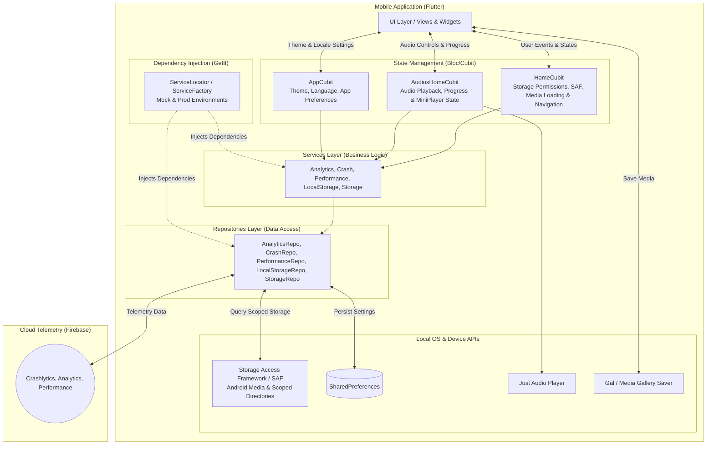

# Ghost Play

[](https://github.com/Piero16301/Ghost_Play/actions/workflows/prod.yaml?query=branch%3Amain)
[](https://codecov.io/gh/Piero16301/Ghost_Play/branch/main)
[](https://opensource.org/licenses/MIT)
[](https://buymeacoffee.com/sanjuanpamk)

Welcome to the comprehensive documentation for the **Ghost Play** application. This guide covers the complete project structure, key Dart files organized by functional modules, their responsibilities, and how they interconnect to manage audio retrieval, playback, status media, video notes, and settings using Android Storage Access Framework (SAF), local device storage, and Firebase telemetry.

---

## 📑 Table of Contents

1. [Architecture](#%EF%B8%8F-architecture)
2. [Project Directory Structure](#-project-directory-structure)
3. [App Core (`lib/app`)](#app-core-libapp)
   - 3.1 [State Management](#state-management)
   - 3.2 [Global Utilities & Router](#global-utilities--router)
   - 3.3 [Helpers](#helpers)
   - 3.4 [Repositories & Services Layer](#repositories--services-layer)
   - 3.5 [UI Layer (View, Widgets & Animations)](#ui-layer-view-widgets--animations)
4. [Feature Modules](#feature-modules)
   - 4.1 [Home (`lib/home`)](#home-libhome)
     - [Audios Home (`audios_home`)](#audios-home-audios_home)
     - [States Home (`states_home`)](#states-home-states_home)
     - [Videos Home (`videos_home`)](#videos-home-videos_home)
   - 4.2 [Settings (`lib/settings`)](#settings-libsettings)
5. [Localization (`lib/l10n`)](#localization-libl10n)
6. [Bootstrap & Entrypoint](#bootstrap--entrypoint)
7. [Packages & Data Models](#packages--data-models)
8. [Configuration & Testing](#configuration--testing)

---

# 🏗️ Architecture



- **UI Layer**: Standardized presentation layer including the main dashboard navigation, WhatsApp audios tab with persistent floating mini-player, WhatsApp statuses gallery, video notes browser, and settings screen.
- **State (Bloc/Cubit)**:
  - `AppCubit`: Manages global app configurations such as dark/light theme, custom accent color, and localization locale.
  - `HomeCubit`: Manages the main scaffold, bottom tab selection, SAF permissions, and loads audios, cached statuses, and video notes.
  - `AudiosHomeCubit`: Coordinates playback streams, position, duration, and controls for the floating audio player via `just_audio`.
- **Persistence (Local DB - SharedPreferences)**: Stores local configurations (theme, color, language) across app reboots via `LocalStorageRepository`.
- **Services & Repositories**: Follows the Repository Pattern with Dependency Injection (`get_it`). Business logic sits in Services; native data handling, preferences, and telemetry wrappers sit in Repositories.
- **Native OS & Scoped Storage**: Uses `saf` (Storage Access Framework) to interact with scoped storage on modern Android versions without root access, seamlessly reading `.opus` audios, `.statuses`, and WhatsApp video notes.

---

# 📁 Project Directory Structure

Below is the complete file and directory layout for the codebase under `lib/` and `test/`:

```
lib/
├── app/                                  # Global application core (shared infrastructure)
│   ├── animations/                       # Reusable micro-animations & transitions
│   │   ├── animations.dart               # Barrel file
│   │   └── circular_loading_animation.dart # Custom circular spinning indicator
│   ├── cubit/                            # Global application state management
│   │   ├── app_cubit.dart                # AppCubit: theme, color, and locale state
│   │   └── app_state.dart                # AppState: immutable state model with copyWith
│   ├── global/                           # Global utilities, DI, router, and themes
│   │   ├── app_dependencies.dart         # GetIt service locator & ServiceFactory
│   │   ├── app_functions.dart            # Common helper functions (formatting, dates, durations)
│   │   ├── app_router.dart               # GoRouter configuration & AppRoute enum
│   │   ├── app_themes.dart               # ThemeData generation (Light, Dark, Custom Color)
│   │   ├── app_variables.dart            # Global constants & default configurations
│   │   └── global.dart                   # Barrel file for global utilities
│   ├── helpers/                          # Helper logic & transformations
│   │   ├── color_helper.dart             # Color conversion & manipulation utilities
│   │   ├── helpers.dart                  # Barrel file
│   │   └── theme_helper.dart             # Theme brightness & style utilities
│   ├── models/                           # Global domain & transfer models
│   │   ├── app_route_observer.dart       # Route observer logging page visits to Analytics
│   │   ├── audio_metadata.dart           # Metadata representation for .opus audio files
│   │   ├── models.dart                   # Barrel file
│   │   └── multimedia_metadata.dart      # Media representation for statuses & video notes
│   ├── repositories/                     # Data access layer (Storage, Prefs, Firebase SDKs)
│   │   ├── analytics_repository.dart     # Firebase Analytics wrapper
│   │   ├── crash_repository.dart         # Firebase Crashlytics wrapper
│   │   ├── local_storage_repository.dart # SharedPreferences data access
│   │   ├── performance_repository.dart   # Firebase Performance monitoring wrapper
│   │   ├── repositories.dart             # Barrel file
│   │   └── storage_repository.dart       # SAF & Android device storage operations
│   ├── services/                         # Business logic layer orchestrating repositories
│   │   ├── analytics_service.dart        # Event tracking & route analytics
│   │   ├── crash_service.dart            # Error reporting & log aggregation
│   │   ├── local_storage_service.dart    # User preferences business operations
│   │   ├── performance_service.dart      # Custom trace performance tracking
│   │   ├── services.dart                 # Barrel file
│   │   └── storage_service.dart          # Scoped storage & media querying service
│   ├── view/                             # Root application UI bootstrap
│   │   ├── app_page.dart                 # Root widget injecting AppCubit & repositories
│   │   ├── app_view.dart                 # MaterialApp.router configuration & localization setup
│   │   └── view.dart                     # Barrel file
│   ├── widgets/                          # Shared UI components
│   │   ├── app_filled_button.dart        # Styled filled button component
│   │   ├── app_outlined_button.dart      # Styled outlined button component
│   │   └── widgets.dart                  # Barrel file
│   └── app.dart                          # App module umbrella barrel file
├── home/                                 # Home module (Main features & tabs)
│   ├── cubit/                            # Main Home state management
│   │   ├── home_cubit.dart               # HomeCubit: SAF permissions, media loading, tab indexing
│   │   └── home_state.dart               # HomeState: active tab, lists of audios/statuses/videos
│   ├── pages/                            # Tab sub-views
│   │   ├── audios_home/                  # Audios tab: browse and listen to voice notes
│   │   │   ├── cubit/                    # AudiosHomeCubit: player state & progress
│   │   │   │   ├── audios_home_cubit.dart
│   │   │   │   └── audios_home_state.dart
│   │   │   ├── view/                     # Audios views
│   │   │   │   ├── audios_home_page.dart # Provider injector for AudiosHomeCubit
│   │   │   │   ├── audios_home_view.dart # Audio list UI & item playback triggers
│   │   │   │   └── view.dart
│   │   │   ├── widgets/                  # Audio specific widgets
│   │   │   │   ├── mini_player.dart      # Floating audio player bar with slider & controls
│   │   │   │   └── widgets.dart
│   │   │   └── audios_home.dart          # Barrel file
│   │   ├── states_home/                  # States tab: browse WhatsApp statuses
│   │   │   ├── view/                     # States views
│   │   │   │   ├── states_home_page.dart # Entry point for States tab
│   │   │   │   ├── states_home_view.dart # Grid view of photo & video statuses
│   │   │   │   └── view.dart
│   │   │   └── states_home.dart          # Barrel file
│   │   ├── videos_home/                  # Videos tab: WhatsApp video notes
│   │   │   ├── view/                     # Videos views
│   │   │   │   ├── videos_home_page.dart # Entry point for Videos tab
│   │   │   │   ├── videos_home_view.dart # Grid view of video notes with recency filter
│   │   │   │   └── view.dart
│   │   │   └── videos_home.dart          # Barrel file
│   │   └── pages.dart                    # Barrel file for all home pages
│   ├── view/                             # Main Home Scaffold
│   │   ├── home_page.dart                # Provider injector for HomeCubit
│   │   ├── home_view.dart                # Main Scaffold with NavigationBar & app bar
│   │   └── view.dart                     # Barrel file
│   ├── widgets/                          # Home module widgets
│   │   ├── multimedia_preview_dialog.dart# Fullscreen preview dialog for images & videos
│   │   └── widgets.dart                  # Barrel file
│   └── home.dart                         # Home module umbrella barrel file
├── l10n/                                 # Localization module
│   ├── arb/                              # Application Resource Bundle files (6 languages)
│   │   ├── app_de.arb                    # German
│   │   ├── app_en.arb                    # English (template source)
│   │   ├── app_es.arb                    # Spanish
│   │   ├── app_fr.arb                    # French
│   │   ├── app_it.arb                    # Italian
│   │   └── app_pt.arb                    # Portuguese
│   ├── gen/                              # Auto-generated localization classes
│   │   ├── app_localizations.dart
│   │   ├── app_localizations_de.dart
│   │   ├── app_localizations_en.dart
│   │   ├── app_localizations_es.dart
│   │   ├── app_localizations_fr.dart
│   │   ├── app_localizations_it.dart
│   │   └── app_localizations_pt.dart
│   └── l10n.dart                         # Extension helpers for BuildContext localization
├── settings/                             # Settings module (Preferences & App Info)
│   ├── view/                             # Settings views
│   │   ├── settings_page.dart            # Settings entry point
│   │   ├── settings_view.dart            # Theme mode, accent color & language pickers
│   │   └── view.dart                     # Barrel file
│   ├── widgets/                          # Settings widgets
│   │   ├── settings_app_specs.dart       # App version & build information display
│   │   ├── settings_card_block.dart      # Standardized group card container
│   │   └── widgets.dart                  # Barrel file
│   └── settings.dart                     # Settings module umbrella barrel file
├── bootstrap.dart                        # Initialization wrapper & zone error handling
├── firebase_options.dart                 # Auto-generated Firebase configuration
└── main.dart                             # Application entrypoint (DI & Firebase setup)
```

```
test/                                     # Comprehensive unit & widget test suite (~100% coverage)
├── app/                                  # Tests for app core
│   ├── animations/                       # Tests for animations
│   ├── cubit/                            # Tests for AppCubit & AppState
│   ├── global/                           # Tests for router, dependencies, themes, functions
│   ├── helpers/                          # Tests for color and theme helpers
│   ├── models/                           # Tests for data models (audio, multimedia, observer)
│   ├── repositories/                     # Tests for all repositories (Mocked & real)
│   ├── services/                         # Tests for all services
│   ├── view/                             # Tests for AppPage & AppView
│   └── widgets/                          # Tests for shared buttons and components
├── helpers/                              # Test utility helpers & mock definitions
│   ├── helpers.dart                      # Barrel file
│   ├── mocks.dart                        # Mocktail mock class definitions
│   ├── pump_app.dart                     # pumpApp test extension with localization & theme
│   └── service_locator.dart              # Test service locator configurations
├── home/                                 # Tests for Home feature
│   ├── cubit/                            # Tests for HomeCubit & HomeState
│   ├── pages/                            # Tests for Audios, States, and Videos home pages & views
│   │   ├── audios_home/
│   │   ├── states_home/
│   │   └── videos_home/
│   ├── view/                             # Tests for HomePage & HomeView
│   └── widgets/                          # Tests for MultimediaPreviewDialog & sub-widgets
├── l10n/                                 # Tests verifying localization delegates
└── settings/                             # Tests for Settings feature
    └── view/                             # Tests for SettingsPage & SettingsView
```

---

## App Core (`lib/app`)

### 1. State Management

| File | Role |
|------|------|
| **lib/app/cubit/app_cubit.dart** | Manages **global app state**: theme mode (system/light/dark), primary accent color selection, and selected locale. |
| **lib/app/cubit/app_state.dart** | Immutable state structure representing theme settings, custom color values, and active locale. |

---

### 2. Global Utilities & Router

| File | Role |
|------|------|
| **lib/app/global/app_dependencies.dart** | Configures `GetIt` service locator (`ServiceFactory`) for production and mock test environments. |
| **lib/app/global/app_functions.dart** | General formatting utilities: format byte sizes, convert timestamps to readable dates, format audio durations. |
| **lib/app/global/app_router.dart** | Declares `GoRouter` navigation graph (`AppRoute.home` at `/`, `AppRoute.settings` at `/settings`) with analytics tracking. |
| **lib/app/global/app_themes.dart** | Creates customizable `ThemeData` instances for light, dark, and dynamic color palettes. |
| **lib/app/global/app_variables.dart** | Application-wide constants, default fallback values, and shared configuration variables. |

---

### 3. Helpers

| File | Role |
|------|------|
| **lib/app/helpers/color_helper.dart** | Provides color space conversion and tone manipulation helpers. |
| **lib/app/helpers/theme_helper.dart** | Evaluates theme brightness, contrast settings, and color adaptations. |

---

### 4. Repositories & Services Layer

Employs the Repository Pattern connected via Dependency Injection. Business logic is isolated in Services, while Repositories abstract lower-level data sources.

| Layer | Responsibility | Key Files |
|-------|----------------|-----------|
| **Repositories** (`lib/app/repositories/`) | Low-level storage interactions, shared preference management, and Firebase SDK wrappers. | `analytics_repository.dart`, `crash_repository.dart`, `local_storage_repository.dart`, `performance_repository.dart`, `storage_repository.dart` |
| **Services** (`lib/app/services/`) | Provides high-level business flows orchestrating the repository layers, consumed by Cubits and Views. | `analytics_service.dart`, `crash_service.dart`, `local_storage_service.dart`, `performance_service.dart`, `storage_service.dart` |

**Key Capabilities:**
- **Local Storage**: `LocalStorageService` to read and write application user preferences (theme mode, color index, locale).
- **Media Storage**: `StorageService` using the Storage Access Framework (`saf`) to access Android scoped storage, query `.opus` audio files, read cached WhatsApp statuses, and retrieve video notes.
- **Infrastructure & Telemetry**: Firebase Crashlytics error logging, performance tracing for disk/loading operations, and screen tracking via Firebase Analytics.

---

### 5. UI Layer (View, Widgets & Animations)

#### View
| File | Role |
|------|------|
| **lib/app/view/app_page.dart** | Root widget bootstrapping `AppCubit` and passing repositories down the tree. |
| **lib/app/view/app_view.dart** | Sets up `MaterialApp.router`, subscribing to `AppCubit` to reflect dynamic theme and language changes. |

#### Widgets & Animations
| File | Role |
|------|------|
| **lib/app/widgets/app_filled_button.dart** | Standard filled action button with loading states. |
| **lib/app/widgets/app_outlined_button.dart** | Standard outlined action button with custom styling. |
| **lib/app/animations/circular_loading_animation.dart** | Reusable spinning indicator for media loading states. |

---

## Feature Modules

### 4.1 Home (`lib/home`)

The primary feature module composed of three main tabs and coordinated by `HomeCubit`:

- **Home Scaffold (`home_page.dart`, `home_view.dart`)**:
  - Displays the bottom `NavigationBar` switching between **Audios**, **States**, and **Videos**.
  - Hosts the app bar action leading to `/settings`.
  - Prompts for SAF storage permissions when not yet granted.
  - Automatically loads and refreshes media across all three categories.

#### Audios Home (`audios_home`)
- **Location**: `lib/home/pages/audios_home/`
- **Cubit**: `AudiosHomeCubit` (`audios_home_cubit.dart`, `audios_home_state.dart`)
- **Key Features**:
  - Lists ingested `.opus` voice notes with duration, date, and file size.
  - Controls playback through `just_audio` (play, pause, seek, completion).
  - Contains `MiniPlayer` (`mini_player.dart`): an interactive floating playback bar overlaid at the bottom of the screen with slider seek support.

#### States Home (`states_home`)
- **Location**: `lib/home/pages/states_home/`
- **Key Features**:
  - Displays cached WhatsApp status media (images and videos).
  - Tapping a status opens `MultimediaPreviewDialog` (`multimedia_preview_dialog.dart`) for full-screen photo viewing or video playback.
  - Allows saving statuses directly to the user's gallery using `gal`.

#### Videos Home (`videos_home`)
- **Location**: `lib/home/pages/videos_home/`
- **Key Features**:
  - Displays WhatsApp video notes in a clean grid.
  - Supports filtering video notes by recency (e.g., all, past week, past 2 weeks).
  - Tapping a video opens `MultimediaPreviewDialog` for playback and gallery export.

---

### 4.2 Settings (`lib/settings`)

- **Location**: `lib/settings/`
- **View**: `SettingsPage`, `SettingsView`
- **Widgets**: `SettingsAppSpecs`, `SettingsCardBlock`
- **Key Features**:
  - **Theme Selection**: Switch between System, Light, and Dark mode.
  - **Color Scheme**: Choose from predefined accent colors dynamically updating the app theme.
  - **Language**: Switch app locale across 6 supported languages.
  - **App Information**: Displays package version, build number, and links via `SettingsAppSpecs`.

---

## Localization (`lib/l10n`)

The application supports **6 languages** with compile-time type safety:

| Language | ARB Source File |
|----------|-----------------|
| **English** (Default) | `lib/l10n/arb/app_en.arb` |
| **Spanish** | `lib/l10n/arb/app_es.arb` |
| **German** | `lib/l10n/arb/app_de.arb` |
| **French** | `lib/l10n/arb/app_fr.arb` |
| **Italian** | `lib/l10n/arb/app_it.arb` |
| **Portuguese** | `lib/l10n/arb/app_pt.arb` |

- Generated delegates reside under `lib/l10n/gen/`.
- Convenient `BuildContext` extensions are provided by `lib/l10n/l10n.dart` (e.g., `context.l10n.appName`).

---

## Bootstrap & Entrypoint

| File | Role |
|------|------|
| **lib/main.dart** | App entrypoint: initializes `WidgetsFlutterBinding`, Firebase, and calls `setupServiceLocator()`. Runs `bootstrap(() => const AppPage())`. |
| **lib/bootstrap.dart** | Sets up `FlutterError.onError` and `PlatformDispatcher.instance.onError` for Firebase Crashlytics tracking and launches the app zone. |
| **lib/firebase_options.dart** | Auto-generated Firebase configuration values per platform. |

---

## Packages & Data Models

### Key Data Models

- **`lib/app/models/audio_metadata.dart`**: Model holding file URI, name, formatted date, duration, and size for voice notes.
- **`lib/app/models/multimedia_metadata.dart`**: Unified model for visual media (WhatsApp statuses and video notes), holding URI, name, timestamp, size, `isVideo` flag, and video duration.
- **`lib/app/models/app_route_observer.dart`**: Custom `NavigatorObserver` logging screen transitions to Firebase Analytics.

### Core Dependencies

- **State Management**: `bloc`, `flutter_bloc`, `equatable`.
- **Storage & Native Access**: `saf` (Storage Access Framework), `shared_preferences`, `gal` (Gallery saver).
- **Media Playback**: `just_audio` (voice notes), `video_player` (video notes & status playback).
- **Navigation**: `go_router`.
- **Telemetry**: `firebase_core`, `firebase_crashlytics`, `firebase_analytics`, `firebase_performance`.
- **DI**: `get_it`.

---

## Configuration & Testing

### Code Quality
- Enforces strict linting standards with **`very_good_analysis`** and **`bloc_lint`**.
- Formatted using `fvm dart format`.
- Clean static analysis with `fvm flutter analyze`.

### Testing Suite
- Comprehensive unit and widget tests across all layers with **>99% line coverage**.
- Test mocks built using `mocktail`.
- Run tests and coverage with:
  ```bash
  fvm flutter test --coverage
  genhtml coverage/lcov.info -o coverage/html
  ```

---

> **Enjoy building and extending the Ghost Play app!**
