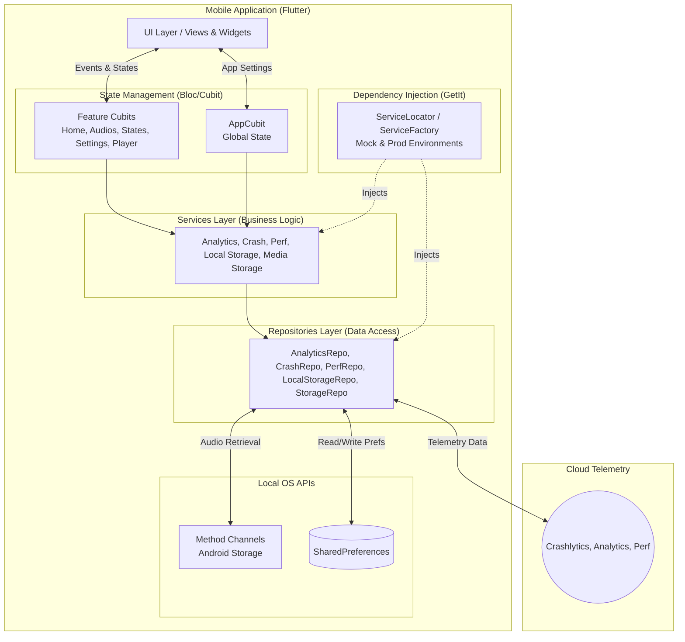

# Ghost Play

Welcome to the comprehensive documentation for the **Ghost Play** application. This guide covers all key Dart files, organized by functional modules, explains their responsibilities, and illustrates how they interconnect to manage audio retrieval, playback, and settings using local device storage and Firebase telemetry.

---

## 📑 Table of Contents

1. [Architecture](#%EF%B8%8F-architecture)
2. [App Core](#app-core)
   2.1 [State Management](#state-management)
   2.2 [Global Utilities](#global-utilities)
   2.3 [Routing & Themes](#routing--themes)
   2.4 [Services](#services)
   2.5 [UI Layer (View & Widgets)](#ui-layer-view--widgets)
3. [Feature Modules](#feature-modules)
   3.1 [Home](#home)
   3.2 [Settings](#settings)
4. [Localization (l10n)](#localization-l10n)
5. [Bootstrap & Entrypoint](#bootstrap--entrypoint)
6. [Packages & Data Models](#packages--data-models)
7. [Configuration (`pubspec.yaml`)](#configuration-pubspecyaml)

---

# 🏗️ Architecture

- **UI (Flutter Interface)**: Standardized presentation layer including the main dashboard, states viewer, video notes gallery, and the persistent floating mini-player.
- **State (Bloc/Cubit)**: Manages the application logic, handles audio playback state (`PlayerCubit`), fetching audios (`AudiosHomeCubit`), managing WhatsApp statuses (`StatesHomeCubit`), and handling WhatsApp video notes (`HomeCubit`).
- **Store (Local DB - SharedPreferences)**: Handles local data persistence across the device, preserving settings such as selected themes and languages.
- **Services & Repositories**: Follows the Repository Pattern. Connects with Dependency Injection (`get_it`). Telemetry is sent via Firebase infrastructure.
- **Native OS APIs**: Uses `MethodChannel` internally to interact with native Android APIs, fetching local `.opus` audio files, cached statuses, and video notes effectively from device storage.

---

## App Core

### 1. State Management

| File                             | Role                                                                                          |
|----------------------------------|-----------------------------------------------------------------------------------------------|
| **lib/app/cubit/app_cubit.dart** | Manages **global app state**: core UI settings (themes, language defaults). |
| **lib/app/cubit/app_state.dart** | Immutable state structures representing settings variants and metadata.       |

---

### 2. Global Utilities

| File                             | Role                                                                                          |
|----------------------------------|-----------------------------------------------------------------------------------------------|
| **lib/app/helpers/***            | App-wide helper functions, potentially processing audio paths or format adjustments. |
| **lib/app/global/***             | Stores constants, global routers, dynamic themes, and definitions for GetIt dependencies. |

---

### 3. Routing & Themes

| File                                  | Role                                                                                  |
|---------------------------------------|---------------------------------------------------------------------------------------|
| **lib/app/global/app_router.dart**    | Defines the `GoRouter` navigation map, creating routing paths between Home and Settings. |
| **lib/app/global/app_themes.dart**    | Orchestrates light, dark, and custom colored themes using Material `ThemeData`. |
| **lib/app/global/app_dependencies.dart** | Maps singletons, repositories, and logic services injecting via `get_it`. |

---

### 4. Repositories & Services Layer

Employs the Repository Pattern connected via Dependency Injection. It isolates business logic from data access and significantly enhances code testability.

| Layer | Responsibility | Key Files |
|-------|----------------|-----------|
| **Repositories** (`lib/app/repositories/`) | Low-level hardware or OS interactions, shared preference management, and SDK API wrappers. | `analytics_repository.dart`, `crash_repository.dart`, `local_storage_repository.dart`, `performance_repository.dart`, `storage_repository.dart` |
| **Services** (`lib/app/services/`) | Provides high-level business flows orchestrating the repository layers, used directly by UI and Cubits. | `analytics_service.dart`, `crash_service.dart`, `local_storage_service.dart`, `performance_service.dart`, `storage_service.dart` |

**Key Capabilities:**
- **Local Storage**: `LocalStorageService` to read and write application app states locally.
- **Media Storage**: `StorageService` providing global access to the device's native media capabilities, handling files and scoped storage integrations.
- **Infrastructure & Telemetry**: Handles Crashlytics error logging, performance tracing, and behavior analytics natively through Firebase integrations.

---

### 5. UI Layer (View & Widgets)

#### View

| File                               | Role                                                                                          |
|------------------------------------|-----------------------------------------------------------------------------------------------|
| **lib/app/view/app_page.dart**     | Root setup bridging standard Flutter providers and connecting cubits to the UI tree. |
| **lib/app/view/app_view.dart**     | Configures `MaterialApp`, assigning the default AppTheme, GoRouter navigation, and l10n definitions. |

#### Widgets

| File                          | Role                                                                                                             |
|-------------------------------|------------------------------------------------------------------------------------------------------------------|
| **lib/app/widgets/***         | Shared components distributed globally (dialogs, custom buttons).                             |
| **lib/app/animations/***      | Common micro-interactions and transitions reusable inside different context trees.                      |

---

## Feature Modules

### Home & Features (Audios, States & Videos)

- **lib/home/pages/***  

**Highlights:**  
- **Audios Home (`audios_home`)**: Interrogates native device capabilities to read local audio directories (specifically fetching recent `.opus` audios) via a `MethodChannel`. Includes an interactive persistent floating player using `just_audio` seamlessly overlaid inside the view.
- **States Home (`states_home`)**: Features a WhatsApp Status Viewer that processes cached scoped-storage files via native channels. It supports previewing media (images and dynamic video playback with proper aspect ratio handling) and saving these statuses directly to the user's photo gallery.
- **Videos Home (`videos_home`)**: Features a WhatsApp Video Notes viewer that allows users to browse recent video notes retrieved from device storage. Users can filter videos by recency (e.g., number of weeks), preview them in a custom dialog, and download/save them directly to the gallery.
- Driven by specific states like `AudiosHomeCubit` (handling audio fetch algorithms), `StatesHomeCubit` (handling media extraction and saving workflows), and `HomeCubit` (managing the video notes state and filtering), coordinated alongside the playback state in `PlayerCubit`.

---

### Settings

- **lib/settings/***  

**Controls:**  
- **UI Customization Hub**: Dictates app appearances, modifying color themes, font settings, and managing app-wide language locale definitions. Connects directly to `AppCubit` and `LocalStorageService` to persist configurations.

---

## Localization (l10n)

| File                               | Role                                                  |
|------------------------------------|-------------------------------------------------------|
| **lib/l10n/app_en.arb**            | Base dictionaries mapped for English translations.    |
| **lib/l10n/app_es.arb**            | Dictionary maps providing Spanish localization.       |
| **lib/l10n/gen/***                 | Folder containing dynamically generated delegates ensuring compile-time localization safety. |

---

## Bootstrap & Entrypoint

| File                          | Role                                                                                   |
|-------------------------------|----------------------------------------------------------------------------------------|
| **lib/bootstrap.dart**        | Wrapper initialization setting global crash intercepts before drawing Flutter widgets. |
| **lib/main.dart**             | Connects Firebase integrations, configures `AppDependencies`, and redirects root run loops to `bootstrap`. |

---

## Packages & Data Models

### Key Data Models

- **lib/app/models/audio_metadata.dart**: Outlines structure detailing localized timestamps, durations, URIs, and descriptions for ingested `.opus` files processing directly from Android Media stores mapping seamlessly to Dart representations.
- **lib/app/models/state_metadata.dart**: Defines the structure for WhatsApp status media files (images and videos), including properties necessary for correct rendering and aspect-ratio orientation.
- **Settings configuration models**: Defined directly alongside `app_state.dart` handling localized preference combinations.

### Packages
- Primary ecosystem relies heavily on `flutter_bloc` and `equatable` mapping robust state architectures.
- Employs `just_audio` managing robust, platform agnostic media playback and playback queues.
- Utilizes the `gal` package allowing direct, seamless saving of status media down to the local photo gallery.

---

## Configuration & Testing

### Configuration (`pubspec.yaml`)
- Uses tools like `flutter_launcher_icons` defining branded visual app icons.
- Ensures stability via **Very Good Analysis** keeping clean linting rules throughout the codebase.

### Testing Architecture
Uses a mock injection testing model mimicking real network environments efficiently:
- **Environment Targeting**: Instantiates `Environment.mock` through `setupServiceLocator` substituting heavy Repositories with standard Mocks (e.g., overriding settings services for safe local modifications).
- **Extensive UI Widgets**: Leverages robust Flutter widget testing frameworks ensuring components like `DeviceBooleanTile` or complex dropdown systems inside `SettingsView` don't overflow unexpectedly checking interactive branch flows carefully.

---

> **Enjoy building and extending the Ghost Play app!**
